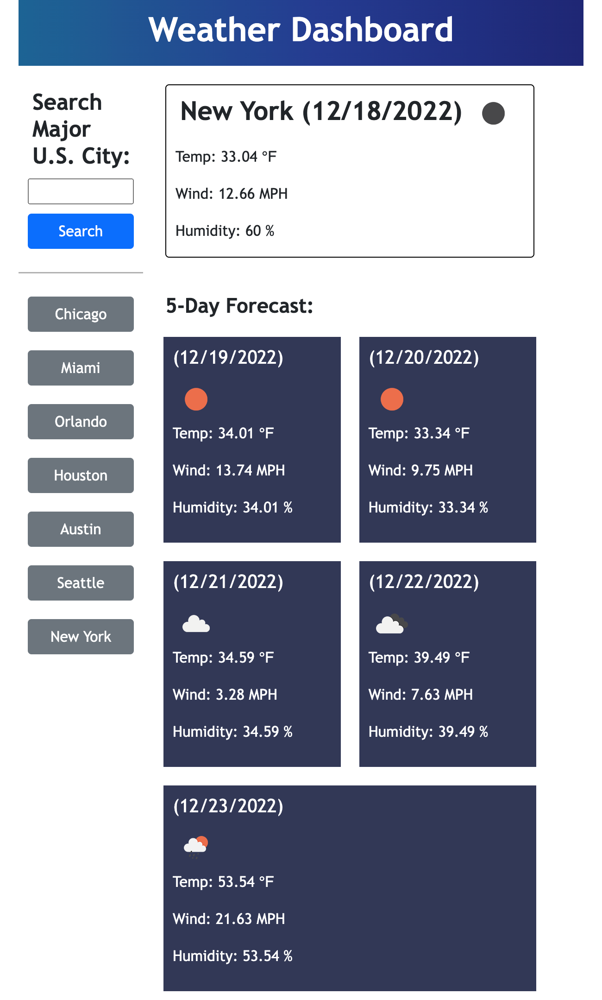

# Module 06 Challenge - Weather Dashboard

>**Application Link:** [Weather Dashboard](https://fannychen623.github.io/Challenge-06-Weather-Dashboard/)
>
>**View:** [Description](#description) / [Application Details](#application-details) / [Application Sample Video](#application-sample-video) / [Responsive Layout Example](#responsive-layout)
>
>**Site Preview:**
>
>
## **DESCRIPTION**
> Topic Assessed: **Server-Side APIs** - **API Key, jQuery (ajax), fetch, etc.**
### **My Task**
*Weather Dashboard* allows a user 
> Create application from scratch. 
>
> Get API key and connect to [OpenWeather](https://openweathermap.org/forecast5) API
> 
> Add search input to search for weather data of a specific city
> 
> Record search history in the local storage and display buttons of the searched cities on the page
> 
> Display today's weather and 5-day weather forecast with weather icons
> 
> Use day.js to output current and forecast dates
> 
> Search history buttons loads weather of labeled city
> 
> **Note:**
> 
> Checks that input city is a major U.S. city
> 
> Takes an average of the weather time-stamps to get the average weather condition of forecasted day
> 
> Duplicate cities do not get added onto the searched history buttons
> 
> New searched cities are added to the top of the list
> 
> No more than 10 cities are kept in the search history at a time
> 
## User Story
```
AS A traveler
I WANT to see the weather outlook for multiple cities
SO THAT I can plan a trip accordingly
```

## Acceptance Criteria
```
GIVEN a weather dashboard with form inputs
WHEN I search for a city
THEN I am presented with current and future conditions for that city and that city is added to the search history
WHEN I view current weather conditions for that city
THEN I am presented with the city name, the date, an icon representation of weather conditions, the temperature, the humidity, and the wind speed
WHEN I view future weather conditions for that city
THEN I am presented with a 5-day forecast that displays the date, an icon representation of weather conditions, the temperature, the wind speed, and the humidity
WHEN I click on a city in the search history
THEN I am again presented with current and future conditions for that city
```

## **APPLICATION DETAILS**

### HTML Information
* **Head**: link reset.css and bootstrap cdn.
* **Bootstrap**: Use bootstrap columns and cards to set-up weather dashboard.
  * Section `searchHistory` to be populated with searched city buttons.
  * Card sections of current weather and 5-day forecast with labels and units to be populated.
* **Comments**: Added indicative comments before each section.

### CSS Information
* **Style**: Style header, headings, define fonts, current weather card, forcast cards, weather icon size.
* **Comments**: Added indicative comments before selectors.

### JavaScript Information
* **Define Major U.S. Cities**: [Array Source](https://gist.github.com/norcal82/42440bd06a67eb7d9616)
* **function loadWeather()**: Load the weather data from the APIs and populate the HTML
    * Check that the city_name value is in the major U.S. cities array.
    * Display the dashboard and format the search history section.
    * Define the two weather APIs used.
      * [Current Weather](https://openweathermap.org/current)
      * [5-Day Forecast](https://openweathermap.org/forecast5)
    * Use jQuery ajax to fetch response from the current weather API.
      * Populate current weather data section with response parameters.
      * Check that there are less than 10 cities and no duplicates in the search history.
      * Add new city to the beginning of the array.
      * Remove last array value if more than 10 cities are recorded.
      * Update search history in the local storage.
      * Populate search history section with buttons of each searched city.
      * Empty the input box for the next value.
    * Define temperature, wind, and humidity values as 0 (used to calculate average forecast weather values).
    * Define forecast cycle to locate region to populate in the HTML.
    * Use jQuery ajax to fetch response from 5-day forecast API.
      * Loop through all the data parameter from the API response and add the weather values.
      * After 8 indicies, take an average of the weather values.
        * The weather condition is defined as the single index value at the middle of the day and not an average.
      * Use the forecast cycle value to populate the respective HTML values.
        * Use day.js and addition to populate each forecasted date value.
      * Set the weather values to 0 and increase the forecast cycle by 1 for the next cycle.
    * If the array of major U.S. cities does not include the city_name value then output an error alert message.
* **$('#searchCityBtn').on('click', function()**: Set the city_name as the input value and run the loadWeather() function.
* **$('input').keypress(function(e) {code})**: If the 'enter' key was pressed, set the city-name as the input value and run the loadWeather() function.
* **$('#searchHistory').on('click', 'button', function()**: Set the city_name as the button text value and run the loadWeather() function.
* **function init()**: Set up the application when the page initializes
  * Hide the weather dashboard before any searches have been made.
  * Get search history from local storage.
  * Loop through the search history to populate the search history section with buttons.

## **APPLICATION SAMPLE VIDEO**
### Sample Video
>

## **RESPONSIVE LAYOUT**
### Screen Size: 650px
>